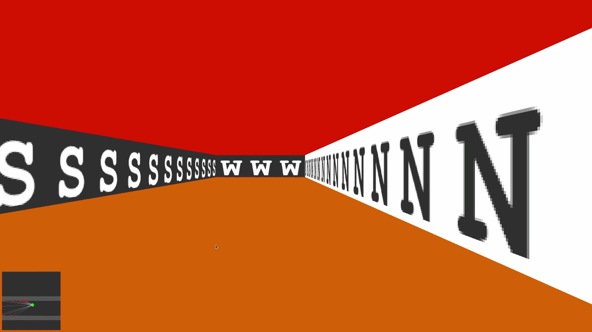

# Cub3D

Cub3D is a small 3D game engine developed as part of the 42 curriculum.  
The goal of the project is to create a basic first-person view using a **raycasting algorithm**, inspired by early 3D games like Wolfenstein 3D.

---
## Gameplay

Basic gameplay showing player movement and the raycasting rendering.

<p align="center">
  
</p>

---

## Custom Wall Textures

Cub3D allows the use of different wall textures.  
Below is an example using an alternative texture set.

<p align="center">
  
</p>

---

## Direction-Based Textures & Sky Color

Each wall direction (North, South, East, West) can have its own texture.  
The ceiling and floor colors can also be customized through the `.cub` configuration file.

<p align="center">
  
</p>

---

## Features

- Raycasting-based rendering
- Textured walls
- Keyboard movement and camera rotation
- Custom `.cub` map parsing
- Wall collision detection
- Configurable floor and ceiling colors
- Player spawn and orientation

---

## Controls

| Key | Action |
|-----|------|
| W | Move forward |
| S | Move backward |
| A | Move left |
| D | Move right |
| ← / → | Rotate camera |
| ESC | Exit game |

---

## Installation

Clone the repository:

```bash
git clone https://github.com/username/cub3d.git
cd cub3d
```

Compile the project:

```bash
make
```

Run the program:

```bash
./cub3D maps/map.cub
```

---

## Map Format

The program uses `.cub` configuration files to define textures, colors, and the map layout.

Example:

```
NO ./textures/north.xpm
SO ./textures/south.xpm
WE ./textures/west.xpm
EA ./textures/east.xpm

F 220,100,0
C 225,30,0

111111
100001
10N001
100001
111111
```

### Map Rules

- The map must be surrounded by walls (`1`)
- Player position is defined by:
  - `N`
  - `S`
  - `E`
  - `W`
- `0` represents empty space
- `1` represents walls

---

## Technologies

- C
- MiniLibX
- Raycasting algorithm
